# マネログ（MoneyLog） — データ設計

## テーブル一覧

```
認証（Supabase管理）
└── auth.users .............. ユーザー（メール・Google認証）

アプリデータ（自分で設計）
├── profiles ................ ユーザー設定・収入情報・同居人数・月開始日
├── fixed_expenses .......... 固定費
├── consumables ............. 消耗品費（日用品・消耗品の購入サイクル管理）
├── recurring_rules ......... 繰り返しルール（変動ルーチン費）
├── transactions ............ 実際の収支記録
├── budgets ................. 月次予算設定
├── shopping_lists .......... 買い物リスト（セッション単位）
├── shopping_items .......... 買い物リストのアイテム
├── calendar_events ......... カレンダー予定
├── work_schedule ........... 勤務カレンダー（収入計算・勤怠実績）
├── income_records .......... 月次収入サマリー（予測vs実績）
├── wishlist_items .......... 欲しいものリスト
├── savings_goals ........... 貯金目標
└── monthly_adjustments ..... 貯金の手動調整
```

---

## ER図

```mermaid
erDiagram
    auth_users {
        uuid id PK
    }

    profiles {
        uuid id PK
        text income_type
        numeric monthly_income
        numeric hourly_wage
        numeric expected_work_days
        int household_members
        int month_start_day
        timestamptz created_at
    }

    fixed_expenses {
        uuid id PK
        uuid user_id FK
        text name
        text category
        numeric amount
        numeric baseline_amount
        text cycle
        int billing_day
        text status
        date start_date
        text notes
        timestamptz created_at
    }

    consumables {
        uuid id PK
        uuid user_id FK
        text name
        text category
        numeric amount
        int quantity
        int cycle_days
        boolean members_scale
        date last_purchased
        text notes
        timestamptz created_at
    }

    recurring_rules {
        uuid id PK
        uuid user_id FK
        text name
        text category
        numeric estimated_amount
        text recurrence_type
        int recurrence_interval
        date start_date
        date next_date
        boolean auto_record
        boolean is_active
        timestamptz created_at
    }

    transactions {
        uuid id PK
        uuid user_id FK
        uuid recurring_rule_id FK
        text type
        text expense_kind
        date date
        text category
        numeric amount
        text memo
        text store_type
        text meal_type
        text payment_type
        text payment_method
        timestamptz created_at
    }

    budgets {
        uuid user_id FK
        text month
        numeric fixed
        numeric consumable
        numeric income
        jsonb one_time_by_category
        timestamptz created_at
    }

    shopping_lists {
        uuid id PK
        uuid user_id FK
        text name
        date planned_date
        text status
        numeric total_budget
        numeric total_actual
        timestamptz created_at
    }

    shopping_items {
        uuid id PK
        uuid list_id FK
        uuid user_id FK
        text name
        text category
        numeric budget_amount
        numeric actual_amount
        text status
        text memo
        boolean is_template
        int sort_order
        timestamptz created_at
    }

    calendar_events {
        uuid id PK
        uuid user_id FK
        date date
        text title
        time start_time
        time end_time
        numeric planned_expense
        text memo
        timestamptz created_at
    }

    work_schedule {
        uuid id PK
        uuid user_id FK
        date date
        text day_type
        numeric hours_worked
        numeric hourly_wage
        numeric daily_income
        text memo
        timestamptz created_at
    }

    income_records {
        uuid id PK
        uuid user_id FK
        text year_month
        numeric expected_income
        numeric actual_income
        int work_days_expected
        int work_days_actual
        text notes
        timestamptz created_at
    }

    wishlist_items {
        uuid id PK
        uuid user_id FK
        text name
        numeric target_amount
        int priority
        date purchased_at
        text notes
        timestamptz created_at
    }

    savings_goals {
        uuid id PK
        uuid user_id FK
        uuid wishlist_item_id FK
        numeric target_amount
        numeric monthly_target
        date deadline
        timestamptz created_at
    }

    monthly_adjustments {
        uuid id PK
        uuid user_id FK
        uuid savings_goal_id FK
        text year_month
        numeric amount
        text memo
        timestamptz created_at
    }

    auth_users ||--|| profiles : "1:1"
    auth_users ||--o{ fixed_expenses : "1:N"
    auth_users ||--o{ consumables : "1:N"
    auth_users ||--o{ recurring_rules : "1:N"
    auth_users ||--o{ transactions : "1:N"
    auth_users ||--o{ budgets : "1:N"
    auth_users ||--o{ shopping_lists : "1:N"
    auth_users ||--o{ calendar_events : "1:N"
    auth_users ||--o{ work_schedule : "1:N"
    auth_users ||--o{ income_records : "1:N"
    auth_users ||--o{ wishlist_items : "1:N"
    auth_users ||--o{ savings_goals : "1:N"
    recurring_rules ||--o{ transactions : "生成元"
    shopping_lists ||--o{ shopping_items : "1:N"
    wishlist_items ||--o| savings_goals : "1:1"
    savings_goals ||--o{ monthly_adjustments : "1:N"
```



---

## テーブル間の関係図

```
auth.users
    │
    ├── profiles（1対1）
    │       ↑ household_members を consumables が参照
    │       ↑ month_start_day をホーム/記録タブが参照
    │
    ├── fixed_expenses（1対多）
    │
    ├── consumables（1対多）
    │
    ├── recurring_rules（1対多）
    │       │
    │       └── transactions（繰り返しから生成された記録）
    │
    ├── transactions（1対多）
    │
    ├── budgets（1対多、user_id + month で複合主キー）
    │
    ├── shopping_lists（1対多）
    │       │
    │       └── shopping_items（1対多）→ transactions へ一括登録
    │
    ├── calendar_events（1対多）
    │
    ├── work_schedule（1対多）← カレンダー表示・収入実績
    │
    ├── income_records（1対多）← 月次収入の予測vs実績
    │
    ├── wishlist_items（1対多）
    │       │
    │       └── savings_goals（1対1）
    │                   │
    │                   └── monthly_adjustments（1対多）
    │
    └── savings_goals（1対多）
            │
            └── monthly_adjustments（1対多）
```

---

## 各テーブルの詳細

### 1. profiles（ユーザー設定）

| カラム名 | 型 | 説明 |
|---|---|---|
| id | uuid | ユーザーID（auth.usersと連動、PK） |
| income_type | text | 収入タイプ `fixed`（固定月収）/ `hourly`（時給制） |
| monthly_income | numeric | 固定月収額 |
| hourly_wage | numeric | 時給 |
| expected_work_days | numeric | 月の想定稼働日数 |
| household_members | int | 同居人数（消耗品費のサイクル計算に使用、デフォルト1） |
| month_start_day | int | 月の開始日（1〜28、ホーム/記録タブの集計期間の起点） |
| created_at | timestamptz | 作成日時 |

> ユーザー登録時に `handle_new_user` トリガーで自動作成される。

---

### 2. fixed_expenses（固定費）

固定費ひとつひとつを登録するテーブル。節約額を計算するために「最初の金額」も保存する。

| カラム名 | 型 | 説明 |
|---|---|---|
| id | uuid | 固定費ID |
| user_id | uuid | どのユーザーの固定費か |
| name | text | 名前（例：Netflix、家賃） |
| category | text | カテゴリ（通信費・住居費など） |
| amount | numeric | 現在の金額（円） |
| baseline_amount | numeric | **最初に登録した金額**（節約額計算の基準） |
| cycle | text | 支払いサイクル `daily` / `weekly` / `monthly` / `yearly` |
| billing_day | int | 引き落とし日（例：25 → 毎月25日） |
| status | text | `active`（契約中）/ `reviewing`（見直し中）/ `cancelled`（解約済み） |
| start_date | date | 登録開始日 |
| notes | text | メモ |
| created_at | timestamptz | 作成日時 |

**節約額の計算イメージ**
```
月間節約額 = baseline_amount - amount
年間節約額 = 月間節約額 × 12
累計節約額 = 月間節約額 × 経過月数
```

---

### 3. consumables（消耗品費）

定期的に必ず購入する消耗品・日用品を品目単位で管理するテーブル。
`profiles.household_members` と連携して実効消費サイクルを計算する。

| カラム名 | 型 | 説明 |
|---|---|---|
| id | uuid | 消耗品ID |
| user_id | uuid | ユーザーID |
| name | text | 品目名（例：トイレットペーパー、歯ブラシ） |
| category | text | カテゴリ（衛生・清潔 / トイレ・洗剤 / サプリ・医療 / 食品 / その他） |
| amount | numeric | 単価（円） |
| quantity | int | 1回の購入個数（デフォルト1） |
| cycle_days | int | 基準消費サイクル（日数、例：60 = 2ヶ月おき） |
| members_scale | boolean | 同居人数に比例してサイクルを短縮するか（true=比例する） |
| last_purchased | date | 最終購入日（次回予定日の計算基準） |
| notes | text | メモ |
| created_at | timestamptz | 作成日時 |

**計算ロジック**
```
実効サイクル日数 = members_scale ? cycle_days ÷ household_members : cycle_days
次回購入予定日   = last_purchased + 実効サイクル日数
月額換算コスト   = (amount × quantity) ÷ (実効サイクル日数 ÷ 30)
```

---

### 4. recurring_rules（繰り返しルール）

「毎週月曜に食費3,000円」のような繰り返しパターンを登録するテーブル。

| カラム名 | 型 | 説明 |
|---|---|---|
| id | uuid | ルールID |
| user_id | uuid | ユーザーID |
| name | text | ルール名（例：週の食費、電気代） |
| category | text | カテゴリ |
| estimated_amount | numeric | 想定金額 |
| recurrence_type | text | 繰り返し種別（下記参照） |
| recurrence_interval | int | 間隔（例：2週おきなら2） |
| start_date | date | 開始日 |
| next_date | date | 次回予定日（自動計算して更新） |
| auto_record | boolean | true=自動記録 / false=手動確認 |
| is_active | boolean | ルールが有効かどうか |
| created_at | timestamptz | 作成日時 |

**recurrence_typeの選択肢**
```
daily    毎日
weekly   毎週（recurrence_interval=1なら毎週、2なら隔週）
monthly  毎月（recurrence_interval=1なら毎月、2なら隔月）
yearly   毎年
```

---

### 5. transactions（収支記録）

実際に記録された収支の一覧。過去の記録はすべてここに入る。

| カラム名 | 型 | 説明 |
|---|---|---|
| id | uuid | 記録ID |
| user_id | uuid | ユーザーID |
| type | text | `income`（収入）/ `expense`（支出） |
| expense_kind | text | `routine`（変動ルーチン費）/ `consumable`（消耗品費）/ `one_time`（臨時出費）/ null（収入） |
| date | date | 日付 |
| category | text | カテゴリ |
| amount | numeric | 金額 |
| memo | text | メモ |
| recurring_rule_id | uuid | 繰り返しルールから生成された場合はそのID、手動入力はnull |
| store_type | text | 店舗種別（任意、例：スーパー・コンビニ・ドラッグストア・100円ショップ・家電量販店） |
| meal_type | text | 食事タイプ（食費カテゴリ時の任意項目：朝食/昼食/夕食/飲み物/その他） |
| payment_type | text | 支払い方法種別（`cash` / `credit_card` / `emoney` / `qr`） |
| payment_method | text | 支払いサービス名（例：楽天カード、PayPay） |
| created_at | timestamptz | 作成日時 |

> `(user_id, date)` にインデックスあり。

---

### 6. budgets（月次予算設定）

月ごとの予算を管理するテーブル。`(user_id, month)` が複合主キー。

| カラム名 | 型 | 説明 |
|---|---|---|
| user_id | uuid | ユーザーID（複合PK） |
| month | text | 対象月（例：`2026-07`、複合PK） |
| fixed | numeric | 固定費予算（円） |
| consumable | numeric | 消耗品費予算（円） |
| income | numeric | その月の収入（予算使用率の計算基準） |
| one_time_by_category | jsonb | カテゴリ別の臨時出費予算（例：`{"食費": 30000}`） |
| created_at | timestamptz | 作成日時 |

---

### 7. shopping_lists（買い物リスト）

買い物セッション単位で管理するテーブル。

| カラム名 | 型 | 説明 |
|---|---|---|
| id | uuid | リストID |
| user_id | uuid | ユーザーID |
| name | text | リスト名（例：スーパー、薬局） |
| planned_date | date | 予定日 |
| status | text | `open`（未購入）/ `done`（記録済み） |
| total_budget | numeric | アイテムの予算合計（自動集計） |
| total_actual | numeric | 実際の合計（記録時に確定） |
| created_at | timestamptz | 作成日時 |

---

### 8. shopping_items（買い物アイテム）

shopping_listsに紐づく個々のアイテム。

| カラム名 | 型 | 説明 |
|---|---|---|
| id | uuid | アイテムID |
| list_id | uuid | 対応する買い物リストID |
| user_id | uuid | ユーザーID |
| name | text | 商品名（例：牛乳、シャンプー） |
| category | text | カテゴリ（記録時にそのままtransactionsへ） |
| budget_amount | numeric | 予算額 |
| actual_amount | numeric | 実際の金額（チェック時に編集可） |
| status | text | `pending`（未購入）/ `bought`（購入済み）/ `skipped`（今回は不要） |
| memo | text | アイテムメモ（任意） |
| is_template | boolean | テンプレートとして次回も使うか |
| sort_order | int | 並び順 |
| created_at | timestamptz | 作成日時 |

**買い物後の記録フロー**
```
1. shopping_items の status=bought のアイテムを取得
2. 各アイテムを transactions に一括 INSERT
   - amount = actual_amount（未入力なら budget_amount）
   - date   = shopping_lists.planned_date
   - category, memo = shopping_items の値
3. shopping_lists.status を done に更新
```

---

### 9. calendar_events（カレンダー予定）

日付に紐づく予定・イベントを記録するテーブル。勤務/休暇の区分は `work_schedule` で管理する。

| カラム名 | 型 | 説明 |
|---|---|---|
| id | uuid | イベントID |
| user_id | uuid | ユーザーID |
| date | date | 対象日 |
| title | text | イベントタイトル |
| start_time | time | 開始時刻（任意） |
| end_time | time | 終了時刻（任意） |
| planned_expense | numeric | 予定出費（デフォルト0） |
| memo | text | メモ |
| created_at | timestamptz | 作成日時 |

---

### 10. work_schedule（勤務カレンダー）

日ごとの勤務状況を記録。カレンダー表示と収入計算の両方に使う。
時給・勤務時間もここで記録するため、過去の実績が設定変更に影響されない。

| カラム名 | 型 | 説明 |
|---|---|---|
| id | uuid | - |
| user_id | uuid | - |
| date | date | 対象日（`user_id + date` でユニーク） |
| day_type | text | `work`（出勤）/ `off`（休み）/ `holiday`（祝日・有給） |
| hours_worked | numeric | 実際の労働時間（nullable） |
| hourly_wage | numeric | **その日の時給をスナップショット**（時給が変わっても過去実績を保持） |
| daily_income | numeric | `hours_worked × hourly_wage`（記録時に計算して保存） |
| memo | text | メモ（例：「午前のみ」） |
| created_at | timestamptz | - |

---

### 11. income_records（月次収入サマリー）

月次で収入の予測と実績を比較するためのサマリーテーブル。
`(user_id, year_month)` でユニーク制約あり。

| カラム名 | 型 | 説明 |
|---|---|---|
| id | uuid | - |
| user_id | uuid | - |
| year_month | text | 対象月（例：`2026-07`） |
| expected_income | numeric | 予測収入（profiles設定から月初に計算） |
| actual_income | numeric | 実際の支給額（振込確認後に入力） |
| work_days_expected | int | 想定稼働日数 |
| work_days_actual | int | 実際の稼働日数（work_scheduleから集計） |
| notes | text | メモ |
| created_at | timestamptz | - |

---

### 12. wishlist_items（欲しいものリスト）

| カラム名 | 型 | 説明 |
|---|---|---|
| id | uuid | アイテムID |
| user_id | uuid | ユーザーID |
| name | text | 商品名（例：カメラ、旅行積立） |
| target_amount | numeric | 目標金額 |
| priority | int | 優先順位（1が最高） |
| purchased_at | date | 購入日（nullなら未購入） |
| notes | text | メモ |
| created_at | timestamptz | 作成日時 |

---

### 13. savings_goals（貯金目標）

欲しいものに対して「いつまでに・毎月いくら貯める」を管理するテーブル。

| カラム名 | 型 | 説明 |
|---|---|---|
| id | uuid | 目標ID |
| user_id | uuid | ユーザーID |
| wishlist_item_id | uuid | 対応する欲しいものID（nullableで独立目標も可） |
| target_amount | numeric | 目標金額 |
| monthly_target | numeric | 毎月の目標積立額 |
| deadline | date | 目標達成期限（任意） |
| created_at | timestamptz | 作成日時 |

---

### 14. monthly_adjustments（貯金の手動調整）

自動計算された余剰に対して、実態に合わせた差分を記録する。

| カラム名 | 型 | 説明 |
|---|---|---|
| id | uuid | - |
| user_id | uuid | - |
| savings_goal_id | uuid | 対象の貯金目標 |
| year_month | text | 対象月（例：`2026-07`） |
| amount | numeric | 調整額（正＝追加、負＝減額） |
| memo | text | 理由（例：「先月分の未入力分を補正」） |
| created_at | timestamptz | - |

---

## セキュリティ（Row Level Security）

全テーブルに RLS（行レベルセキュリティ）を設定：
- **SELECT / INSERT / UPDATE / DELETE**：`user_id = auth.uid()` のみ許可
- `profiles` のみ `id = auth.uid()` で判定（user_id カラムがなく id が PK 兼外部キー）
- `budgets` は `(user_id, month)` 複合主キーで同様にポリシー適用済み
